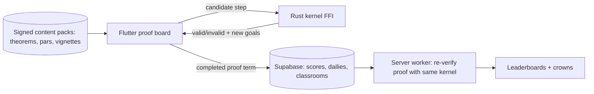

# Axiom — rigor as play

Chess apps turned an intimidating discipline into a daily habit for a hundred million people. Axiom does the same for mathematical proof. Each puzzle is a real theorem — the base angles of an isosceles triangle are equal, there are infinitely many primes, a graph has an Eulerian circuit iff every vertex has even degree — and you prove it by dragging and snapping logic blocks: axioms, previously proven lemmas, inference rules. Underneath, a genuine verification kernel checks every step, so when Axiom says you proved it, you actually did. The feeling it sells is the oldest high in mathematics: the moment the last block clicks and the whole structure lights up because it *must* be true.

## 1. Overview
- **Elevator pitch:** A puzzle game whose puzzles are actual mathematical proofs, built on a real verification kernel. Progress from Euclid to graph theory along a 2,500-year map, chase elegance crowns for the shortest proof, and share your Daily Proof result Wordle-style.
- **Category:** Game — puzzle / education crossover.
- **Tagline:** *Rigor as play.*
- **Play Store positioning:** "The proof game: what chess apps did for chess, Axiom does for mathematics."

## 2. Problem & Why Now
Mathematics education apps are overwhelmingly arithmetic drills and exam prep — the *calculation* half of math. The *reasoning* half, proof, is where the beauty lives, and it is taught almost nowhere outside university courses, despite an enormous latent audience: the people who watch 3Blue1Brown (5M+ subscribers), solve Wordle variants, and buy popular math books. Three timing signals: (1) Wordle proved a daily shareable puzzle with a spoiler-free result grid can carry a product to tens of millions with zero marketing; (2) proof assistants (Lean, Coq) went from academic curiosities to a genuine movement — Lean's mathlib community and Terence Tao's public formalization projects made "formal proof" culturally visible; (3) chess.com's puzzle economy showed people happily grind abstract puzzles daily for rating points. Nobody has combined the three. The hard part — making a verifier feel like a toy — is a design problem, and it is exactly the moat: this app is very hard to clone well.

## 3. Target Audience & Personas
- **Tomás, 19, CS undergrad, Mexico City.** Discrete math course is kicking him around. Axiom's natural-deduction chapters are literally his syllabus as a game. Finds it via a professor's recommendation; sticks for the leaderboards; his study group compares Daily Proof grids.
- **Grace, 36, data analyst, Melbourne.** Was "good at math" until proofs scared her off in college. Plays Wordle, NYT Connections, chess puzzles at lunch. Axiom's geometry chapters give her the closure she never got. She is the emotional core of the audience: the wounded math lover.
- **Ravi, 14, olympiad aspirant, Chennai.** Grinds everything competitive. The elegance crowns (shortest proof) and per-theorem leaderboards are his obsession; his coach uses Axiom's contradiction chapter as homework.

## 4. Core Concept Deep-Dive
A proof in Axiom is a **tree you grow by hand**. The theorem sits at the top as an unproven amber node. You work backward ("to show A∧B, it suffices to show A and B separately" — tap the goal, choose a *move*) or forward (drag an axiom or lemma from your satchel onto the board, snap it against a goal it matches). Each snap is checked by the kernel instantly: valid steps click home with a satisfying mechanical *thunk* and a green flash along the connecting edge; invalid ones bounce with a soft rubber refusal — never a red X, never a buzzer. When the last leaf grounds out in an axiom, the whole tree illuminates from the leaves upward in a cascade, and the theorem's node turns to cut glass. That cascade is the game's dopamine signature, and it is earned by logic, not luck.

**Moves, not syntax.** Players never type formal syntax. Every inference rule is a physical gesture on the board: *split* a conjunction (pull it apart with two fingers), *suppose* an implication's antecedent (fold a new assumption card into play), *contradict* (flip the goal over to its dark side and hunt for the impossible), *induct* (a domino icon: prove the base, then the step, watching ghost dominoes fall). The formal engine is real; the interface is toys.

**Elegance scoring.** Every theorem records your proof length against the book's shortest known. Match it: a gold crown. Beat the community median: silver. There are theorems where the crown proof is a famous historical gem (Euclid's infinitude of primes in five moves), and discovering it yourself is the game's endgame content. Per-theorem leaderboards rank by length, then time.

**The Grand Map.** Progression is a hand-illustrated map flowing through eras: *The Riverlands of Geometry* (Euclid: triangles, circles, parallels), *The Numbered Steppes* (parity, divisibility, primes, induction), *The Logic Fens* (propositional and predicate reasoning as its own pleasure), *The Bridges of Königsberg* (graph theory), and beyond (sets, infinities, a taste of group theory as "symmetry machines"). Each region ends in a **Keystone** — a landmark theorem (Pythagoras, infinitude of primes, Euler's bridges) with a 90-second illustrated historical vignette. Lemmas you prove become tools in your satchel forever: the game literally builds mathematics cumulatively, which is the pedagogy and the collection mechanic in one.

**Hints teach strategy, not answers.** Three escalating tiers per theorem: a *Socratic nudge* ("What would be the worst thing that could happen if this were false?"), a *strategy card* ("This one yields to induction — what's the smallest case?"), and a *ghost step* (shows one valid move dimly, doesn't place it). Hints cost nothing but crown eligibility — knowledge is never paywalled behind consumables.

**Daily Proof.** One hand-tuned theorem daily, same for everyone, difficulty waving through the week (Monday gentle, Saturday spicy). Result card: a spoiler-free grid of your proof tree's *shape* in colored blocks, plus move count vs. par — instantly recognizable in a group chat, revealing nothing.

## 5. Complete Feature Set
**MVP (v1.0):**
- Verification kernel (natural deduction core + geometry/arithmetic theories) with the gesture-move interface; 8 core move types.
- Riverlands of Geometry + Numbered Steppes: 120 theorems, 2 Keystones with vignettes.
- Satchel (earned lemma collection), elegance crowns, per-theorem leaderboards.
- Daily Proof with shareable tree-shape grid and 30-day archive.
- Hint ladder (nudge/strategy/ghost), full offline play (dailies cached a week ahead).
- Practice forge: infinite procedurally varied drills for any mastered move type.
**v1.x fast-follows:**
- Logic Fens region (60 theorems); proof replay theater (watch any of your proofs rebuild itself, exportable as video); streak "chapters" and rating system (Elo-like "Rigor" score from timed drills).
- Classroom codes: a teacher creates a group, sees anonymized progress heatmaps (free — it's a growth engine, not a product yet).
**v2.0+:**
- Bridges of Königsberg (graph theory) + Infinite Gardens (sets, Cantor's diagonal as a boss fight).
- Duel mode: same theorem, split screen race, chess-clock timing.
- Proof editor for user-made theorem packs (curated, kernel-checked before publishing).

## 6. Screen-by-Screen UX Walkthrough
Navigation: bottom bar with **Map**, **Daily**, **Forge**, **Satchel**, **Profile**.
- **Map:** the illustrated Grand Map, pinch-zoomable; theorem nodes as wax seals (amber = open, glass = proven, crowned = gold rim); Keystones as monuments. Region gates show "12/20 seals to open the pass."
- **Proof Board:** the play screen. Goal tree center-stage on parchment; satchel drawer at bottom (axioms/lemmas as tiles with plain-language names — "If two sides equal, base angles equal"); move wheel appears on goal tap; top bar holds par counter and hint bell. Everything one-thumb reachable; landscape supported for tablets.
- **Victory cascade:** the illumination, then a card: moves vs. par, crown state, time, +Rigor, one-tap "share tree", one-tap "next theorem."
- **Daily screen:** today's sealed envelope opens with a wax-crack animation; after solving, the community histogram of move counts fades in under your result.
- **Forge:** pick a move type → endless drills at adaptive difficulty; a heat meter shows mastery decaying over weeks (spaced repetition, disguised as upkeep).
- **Satchel:** your lemma collection as a beautiful reference — tap any lemma to see *your own proof* of it replayed. This screen quietly becomes the best math notebook the player has ever owned.
- **Profile:** Rigor rating graph, crowns, streak chapters, classroom membership.
**Key flow — first five minutes:** cold open on a proof board mid-solve (one move from victory) → the player is nudged to make the final snap → cascade fires on minute one → "You just finished a 2,300-year-old proof. Start your own?" → theorem 1 (vertical angles are equal) with the move wheel introduced one gesture at a time. The tutorial teaches *backward reasoning first* — the mathematician's actual secret — before any formal vocabulary appears.
**Key flow — daily ritual:** notification (off by default, offered after first daily solved) → envelope → solve → histogram → share to group chat → open archive if streak-minded. Median loop: 6 minutes.

## 7. Design Language
Aesthetic: *illuminated manuscript meets precision instrument* — warm parchment fields, deep ink, gold-leaf accents reserved exclusively for proven truth; region-specific accent hues (geometry teal, number-theory ochre, logic violet). Type: a chancery-flavored serif (EB Garamond) for theorem statements — math deserves beauty — with a crisp geometric sans (Inter) for UI. Motion: mechanical satisfaction — snaps have weight, the cascade is the only extravagant animation and it never dulls. Sound: woodblock clicks, paper slides, and a resolving harmonic chord on cascade whose final note rises with proof elegance (crowned proofs sound *better*). Haptics: the thunk on valid snap; a barely-there tick per cascade node.

## 8. Technical Architecture
Opinionated stack: **Flutter** for the client (the board is custom canvas rendering anyway, and iOS is an inevitable fast-follow), with the **verification kernel in Rust compiled to native libraries via FFI** — small trusted core (~3k lines), sequent-calculus engine with pluggable theories (equality, linear arithmetic, geometry primitives, graphs), proof terms checked not trusted from UI state. Content (theorems, par proofs, vignettes) ships as versioned signed packs — playable fully offline, updated without app releases. Backend: **Supabase** — auth (optional; anonymous by default), leaderboards, daily distribution, classroom groups; Postgres row-level security keeps it small-team-simple. Kernel determinism means leaderboard verification is trivial: submitted proofs are re-checked server-side by the same Rust kernel in a worker.

Offline: everything except leaderboards; results queue and sync. Anti-cheat: proofs are self-certifying (the term either checks or it doesn't); only timing can be gamed, and timing never outranks length.

## 9. Data Model
- **Player:** `id`, `handle?`, `rigor_rating`, `streak_chapters[]`, `settings`, `classroom_ids[]`.
- **Theorem (content):** `id`, `region`, `statement_ast`, `statement_prose`, `axioms_available[]`, `par_length`, `crown_proof_term`, `hint_tiers[3]`, `vignette_ref?`.
- **ProofRecord:** `player_id`, `theorem_id`, `proof_term`, `length`, `duration_s`, `crown{gold|silver|none}`, `hints_used`, `created_at`.
- **DailyResult:** `date`, `player_id`, `length`, `duration_s`, `tree_shape_hash` (for the share grid), `verified:bool`.
- **Lemma (derived):** satchel entries reference ProofRecords — your tools are your history.
- **Classroom:** `code`, `owner_id`, `member_ids[]`, `assigned_region?`.

## 10. Monetization
Freemium, knowledge-friendly. **Free forever:** Riverlands region complete (40 theorems), Daily Proof always, Forge basics, leaderboards. **Axiom Scholar — $6.99/month, $39.99/year, or $89.99 lifetime** (regional tiers; students verified via classroom codes get year pricing at $19.99): all regions, replay theater video export, full Forge with mastery tracking, streak repair (2/month), early access to new regions. No ads anywhere — an ad interrupting a proof would be product vandalism. No consumables, no energy. Paywall placement: the pass out of the Riverlands ("The Numbered Steppes lie beyond — 80 theorems, induction, and the infinitude of primes"), and the replay-export button. Conversion logic: the free region is genuinely complete (trust), the daily keeps free users in orbit indefinitely, and each Keystone vignette ends with a one-line tease of the next region's landmark. Target 3.5–5% free→paid; lifetime option captures the gift market (parents, teachers).

## 11. Play Store Listing
- **Title (≤30):** `Axiom: The Proof Game` (21)
- **Short description (≤80):** `Prove real theorems. Daily puzzle, elegance crowns, 2,500 years of math.` (72)
- **Full description:** open with the chess-apps analogy; blocks: Real Proofs, Really Checked (the kernel, no fake steps); From Euclid to Königsberg (the map); The Daily Proof (share grid); Crowns for Elegance; Learn the Moves, Not the Jargon. Close with classroom note and offline support.
- **ASO keywords:** math puzzle game, proof game, logic puzzle, geometry game, daily puzzle like wordle, brain training math, discrete math practice, induction practice, math game for adults, olympiad math.
- **Content rating:** Everyone. Education category flags: none sensitive; no UGC in v1 (leaderboard handles only — profanity-filtered).
- **Data safety:** optional account, progress data, no ads SDKs, no location; families-friendly posture but not targeting children primarily (avoid Designed for Families obligations unless deliberately entering).

## 12. Growth & Marketing Plan
Launch: (1) the Daily Proof share grid is the core loop — seed it in math Twitter/Mastodon and group-chat culture with a "day 1 theorem" everyone talks about (the five-move Euclid gem); (2) creator seeding: 3Blue1Brown-adjacent YouTubers, Matt Parker, math TikTok — offer them a custom theorem pack named after their channel; (3) Hacker News/r/math launch post written as "I built a game where the proofs are real (kernel inside)" — the technical honesty is the hook; (4) teacher beta before public launch so classroom codes exist on day one (teachers are free distribution with built-in retention). Ongoing: a public "Crown Ledger" page per theorem (who holds shortest proofs) creates speedrun-community dynamics; monthly new-theorem drops; an annual "Proof Olympiad" week with a medal event. Play editorial: pitch for "apps for learning" and Indie Corner — education+game hybrids with real rigor are rare featuring material.

## 13. Analytics & KPIs
North star: **weekly proofs completed per active user** (target ≥ 5 by month 2). Key events: `tutorial_cascade`, `theorem_complete{id, length, hints}`, `crown_earned{tier}`, `daily_complete`, `daily_shared`, `region_gate_view`, `sub_start{plan}`, `forge_session`, `classroom_join`. Thresholds: tutorial cascade reach ≥ 80%; D1 ≥ 40%, D30 ≥ 15% (daily-puzzle benchmarks); share rate on dailies ≥ 10%; hint-tier-3 usage < 25% of solves (higher means difficulty curve is broken); free→paid ≥ 3.5%; server re-verification failures ≈ 0 (any spike = client kernel bug, page the dev).

## 14. Risks & Mitigations
- **The verifier feels like syntax homework:** relentless playtesting with non-mathematicians; the gesture-move layer is the product — budget 30% of dev time to it; kill criterion in dev plan.
- **Difficulty cliff at induction:** the Forge exists precisely to pre-drill moves before theorems need them; adaptive gating inserts drills automatically when a player fails a theorem twice.
- **Niche ceiling fear:** the wounded-math-lover market is far larger than the math-major market — messaging always leads with feeling ("the click"), never prerequisites.
- **Content pipeline (hand-tuning theorems is slow):** the pack system decouples content from releases; par proofs are crowd-refined post-launch (community finds shorter proofs → crowns recalibrate with credit).
- **Cloning risk:** shallow clones can copy the look but not the kernel + curriculum; publish nothing about pack formats; move fast on regions.
- **Play policy:** minimal exposure; keep leaderboard handles filtered; if entering Designed for Families later, re-audit all SDKs.

## 15. Competitive Landscape
- **Euclidea / Pythagorea:** beloved geometry-construction puzzles; construction ≠ proof (no logical structure, no kernel); Axiom is the reasoning layer they never built. Their fanbase is Axiom's warmest install pool.
- **Brilliant:** interactive STEM courses, subscription; teaches *about* reasoning with multiple-choice interactivity — no free-form proof, no game economy, no daily ritual. Axiom is a game first and rigorous first.
- **DragonBox / Algebra apps:** proved math mechanics can feel like toys, aimed at kids and algebra manipulation; no proof, no adult audience.
- **The Natural Number Game (Lean, web):** the cult classic proving demand exists; unapologetically technical, zero game design, desktop-only. Axiom is its mass-market descendant.
- **chess.com puzzles / Wordle:** the habit competitors — Axiom borrows their loops (rating, daily, share grid) rather than fighting them.

## 16. Development Plan
Solo dev + a part-time math-content collaborator, ~28 weeks. W1–4: Rust kernel core (propositional + equality), Flutter board prototype with 5 moves; **kill criterion:** if a non-math friend can't finish theorem 3 unaided by week 4, redesign the move layer before any content work. W5–8: geometry theory + 40 Riverlands theorems; cascade/sound/haptics pass. W9–12: Numbered Steppes (induction UX is its own mini-project), satchel, crowns. W13–15: Daily system, share grid, Supabase, server re-verification. W16–18: Forge + adaptive difficulty. W19–20: Keystone vignettes (contract an illustrator, ~$2k). W21–23: closed beta with 2 classrooms + 300 public testers; difficulty telemetry tuning. W24–26: onboarding polish, store assets, trailer (the cascade sells itself in 15 seconds). W27–28: buffer + launch. **If behind:** cut Forge to v1.1, cut one Keystone vignette, ship 90 theorems instead of 120 — never cut the kernel's server verification or the daily.

## 17. Moonshots
- **Lean bridge:** export any Axiom proof as a Lean 4 term; a "graduates" pipeline into real formalization communities — and a press story no one else can tell.
- **The Millennium Room:** guided expeditions through famous *open* problems' landscapes (what's known, where the walls are) — not solvable, but walkable.
- **Proof duels as a spectator sport:** streamed weekly finals with commentary; the tree visualization makes proofs watchable for the first time.
- **AR chalkboard:** cast your proof tree onto a wall and walk your family through it.
- **National curriculum packs:** co-designed regional editions (India boards, IB, Common Core) sold to schools — the classroom codes become a real B2B line.
